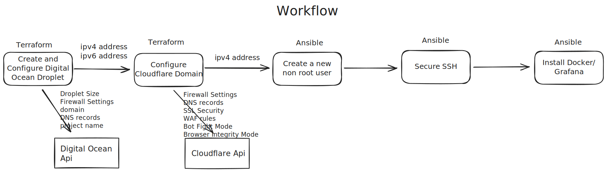

# Verturus
Verturus is my grafana/prometheus setup for monitoring projects hosted on a Digital Ocean Droplet. Automated Script for deploying and configuring a digital ocean droplet with one command

<h2>Workflow</h2>

